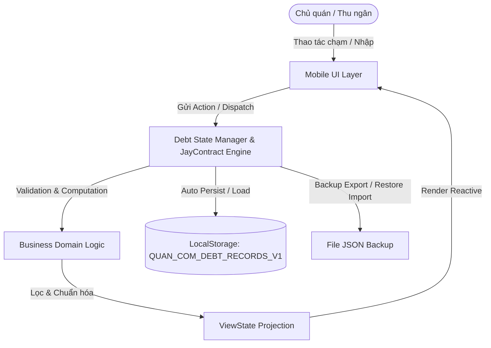
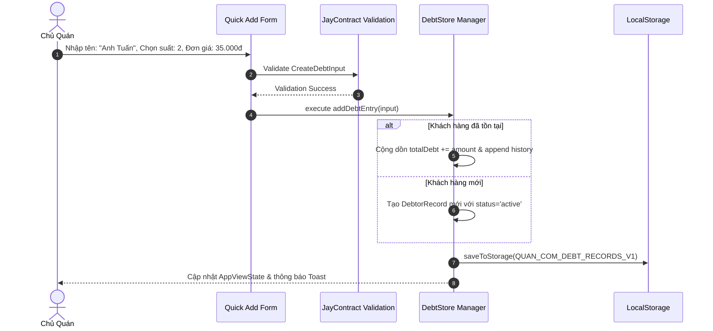

# Design Log #0001: Sổ Ghi Nợ Quán Cơm (Local-First Mobile Web App)

## 1. Background
Các quán cơm bình dân, quán ăn trưa thường xuyên phát sinh tình huống khách quen (nhân viên văn phòng lân cận, công nhân, sinh viên) ăn nợ theo đợt và thanh toán vào cuối tuần/cuối tháng. Hiện tại, các chủ quán thường sử dụng sổ tay giấy hoặc ghi nhớ tạm thời. Giải pháp này dễ gây nhầm lẫn thất thoát, khó tra cứu lịch sử, dễ mất sổ và tốn thời gian tính toán thủ công khi khách cộng dồn nhiều bữa ăn.

Mục tiêu là xây dựng ứng dụng Web Mobile-First, Local-First, tĩnh 100% (zero backend, zero operational cost, deploy được trên Vercel/GitHub Pages), hoạt động ngoại tuyến (offline) mượt mà trên trình duyệt điện thoại.

## 2. Problem
- **Thất lạc & Rủi ro vật lý:** Sổ giấy dễ mất, ướt, mờ chữ.
- **Tốc độ & Nhầm lẫn khi tính nợ:** Khi quán đông khách lúc cao điểm trưa, chủ quán cần thao tác nhanh (< 3 giây) để ghi nợ 1 khách hoặc cộng dồn nợ cũ mà không phải bấm máy tính tay.
- **Tra cứu khó khăn:** Khó tìm lại tên khách trong sổ dày nếu không nhớ ngày ăn.
- **Chi phí & Phức tạp:** Chủ quán không muốn trả tiền server, database hàng tháng hay cài đặt app phức tạp từ Store.

## 3. Questions and Answers
- **Q1: Dữ liệu được lưu trữ ở đâu? Có an toàn khi tắt trình duyệt không?**
  - **A1:** Dữ liệu lưu trực tiếp vào `localStorage` của trình duyệt dưới khóa `QUAN_COM_DEBT_RECORDS_V1` và cài đặt `QUAN_COM_SETTINGS_V1`. Dữ liệu tồn tại vĩnh viễn trên thiết bị trừ khi người dùng xóa cache trình duyệt. Hệ thống cung cấp tính năng Export/Import file JSON để sao lưu định kỳ.
- **Q2: Tìm kiếm tiếng Việt không dấu có hoạt động khi gõ nhanh không?**
  - **A2:** Có, hệ thống sử dụng thuật toán chuẩn hóa chuỗi `normalizeVietnamese()` loại bỏ toàn bộ dấu thanh/hoa thường và lưu sẵn trường `normalizedName` để lọc realtime < 5ms.
- **Q3: Trải nghiệm di động (PWA/One-Thumb) như thế nào?**
  - **A3:** Nút bấm tối thiểu 44px, hỗ trợ tăng giảm số lượng suất `[ - ] [ + ]`, thanh toán 1 chạm kèm modal xác nhận, có hỗ trợ PWA Web App Manifest để cài đặt ra màn hình chính (Add to Home Screen) và chạy offline.
- **Q4: Xử lý trùng tên khách hoặc cộng dồn như thế nào?**
  - **A4:** Khi ghi nợ với tên khách đã tồn tại (so sánh không phân biệt hoa thường / khoảng trắng), hệ thống tự động cộng dồn nợ vào hồ sơ hiện có và bổ sung 1 bản ghi vào danh sách `history`. Có gợi ý tên khách tự động (autocomplete/chips) để chủ quán chọn nhanh.

## 4. Design

### 4.1. Architecture Diagram (Mermaid)



### 4.2. State Flow Diagram (Mermaid)



### 4.3. Contracts & Data Types (`Contract`, `JayContract`)

File Path: `file:///E:/GhiNoApplication/src/types/contracts.ts`

```typescript
export interface DebtHistoryEntry {
  entryId: string;       // Format: "ENT_<timestamp>_<random>"
  timestamp: string;     // ISO format: "2026-08-28T12:30:00.000Z"
  displayDate: string;   // Vietnamese format: "12:30 28/08/2026"
  quantity: number;      // >= 1
  pricePerMeal: number;  // >= 0 (VNĐ)
  amount: number;        // = quantity * pricePerMeal
  note?: string;         // Optional note
}

export interface DebtorRecord {
  id: string;            // Format: "KH_<timestamp>_<random>"
  name: string;          // Trimmed customer name
  normalizedName: string;// Trimmed lowercase non-accented string
  phone?: string;        // Optional phone number
  totalDebt: number;     // Sum of all active unpaid entries
  status: 'active' | 'settled';
  createdAt: string;     // ISO String
  updatedAt: string;     // ISO String
  history: DebtHistoryEntry[];
}

export interface AppSettings {
  restaurantName: string;
  defaultMealPrice: number;
  phoneContact?: string;
  currency: string;
}

export interface CreateDebtInput {
  name: string;
  quantity: number;
  pricePerMeal: number;
  note?: string;
  phone?: string;
}

export interface SettleDebtInput {
  debtorId: string;
  note?: string;
}

export interface UpdateDebtorInput {
  debtorId: string;
  name: string;
  phone?: string;
}

export interface DeleteHistoryEntryInput {
  debtorId: string;
  entryId: string;
}

export interface BackupPayload {
  version: string;
  exportedAt: string;
  app: string;
  settings: AppSettings;
  records: DebtorRecord[];
}

// JayContract for Validation & State Guard
export interface JayContract<TInput, TOutput> {
  validate(input: unknown): { isValid: boolean; errors: string[]; sanitized?: TInput };
  execute(input: TInput): TOutput;
}
```

### 4.4. ViewState Definition

File Path: `file:///E:/GhiNoApplication/src/types/viewState.ts`

```typescript
export interface DebtorViewState {
  id: string;
  name: string;
  normalizedName: string;
  phone?: string;
  totalDebt: number;
  formattedTotalDebt: string;
  status: 'active' | 'settled';
  entryCount: number;
  latestEntryDisplayDate: string;
  history: DebtHistoryEntry[];
}

export interface SummaryStatsViewState {
  totalActiveDebt: number;
  formattedTotalActiveDebt: string;
  totalActiveDebtors: number;
  totalSettledDebtors: number;
  todayRecordedAmount: number;
  formattedTodayRecordedAmount: string;
  todayMealsCount: number;
}

export interface AppViewState {
  searchQuery: string;
  filteredDebtors: DebtorViewState[];
  allActiveDebtors: DebtorViewState[];
  allSettledDebtors: DebtorViewState[];
  summary: SummaryStatsViewState;
  settings: AppSettings;
  activeFilter: 'all' | 'active' | 'settled';
  selectedDebtorDetail?: DebtorViewState;
  isQuickAddOpen: boolean;
  isSettingsOpen: boolean;
  isBackupRestoreOpen: boolean;
}
```

### 4.5. Validation Rules
- `name`: Bắt buộc, độ dài từ 2 đến 100 ký tự sau khi `trim()`.
- `quantity`: Số nguyên dương $\ge 1$ và $\le 1000$.
- `pricePerMeal`: Số nguyên $\ge 0$ và $\le 100.000.000$ VNĐ.
- `phone`: Tùy chọn, nếu có thì gồm 9-12 chữ số.
- `BackupPayload`: Phải chứa `version`, `records` dạng mảng hợp lệ, mỗi record có đủ trường định danh và tính toán hợp lệ.

## 5. Implementation Plan (TDD Approach)

1. **Giai đoạn 1: Khởi tạo Project & Cấu hình Test Suite**
   - Thiết lập Vite + React + TypeScript + Tailwind CSS + Vitest + React Testing Library.
   - Cài đặt Lucide Icons (`lucide-react`) cho UI Mobile đẹp và nhẹ.

2. **Giai đoạn 2: TDD cho Core Logic & JayContract Helpers**
   - Viết test cho `vietnameseUtils` (chuẩn hóa tên, tìm kiếm không dấu, định dạng ngày tiếng Việt, format tiền tệ VNĐ).
   - Viết test cho `debtValidator` (`JayContract` implementation cho `CreateDebtInput`, `BackupPayload`).
   - Viết test cho `debtEngine` (Tạo nợ mới, cộng dồn nợ cũ, thanh toán nợ, xóa lịch sử, cập nhật thông tin, tính toán ViewState).

3. **Giai đoạn 3: TDD cho Storage Layer & Backup/Restore**
   - Viết test cho `storageEngine` (Lưu/Đọc localStorage, xử lý ngoại lệ quota/parse JSON, Import/Export).

4. **Giai đoạn 4: Xây dựng UI Components Mobile-First**
   - `Header`: Tên quán + Nút Cài đặt / Sao lưu.
   - `SummaryCards`: Thống kê tổng nợ, số khách nợ, số suất ăn hôm nay.
   - `QuickAddForm`: Tên khách + Autocomplete chips + Tăng giảm suất `[ - ] [ + ]` + Đơn giá + Nút ghi nợ lớn.
   - `SearchBar & Filters`: Tìm kiếm tức thì không dấu, lọc Trực tiếp / Đã thanh toán.
   - `DebtorCard`: Thẻ khách hàng, số nợ đỏ nổi bật, nút Thanh toán nhanh, nút xem chi tiết.
   - `DebtorDetailModal`: Xem lịch sử từng lần nợ, xóa từng lần nợ, in/chia sẻ thông tin nợ.
   - `SettleConfirmModal`: Xác nhận đóng nợ tránh bấm nhầm.
   - `SettingsModal`: Đổi tên quán, đổi đơn giá mặc định (35k -> tùy chỉnh).
   - `BackupRestoreModal`: Xuất file JSON, nhập file JSON kèm preview trước khi ghi đè.

5. **Giai đoạn 5: PWA & Offline Support**
   - Cấu hình Web App Manifest (`manifest.json`), service worker, theme-color, meta viewport chống zoom nhầm khi gõ trên mobile.

6. **Giai đoạn 6: Kiểm thử tổng thể, E2E Build & Báo cáo**
   - Chạy toàn bộ test suite (`vitest run`).
   - Chạy `vite build` kiểm tra bundle tĩnh.
   - Cập nhật phần "Implementation Results" trong Design Log #0001.

## 6. Examples

### ✅ Valid Scenarios
- **Tạo nợ mới:**
  ```json
  {
    "name": "Anh Tuấn Viettel",
    "quantity": 1,
    "pricePerMeal": 35000,
    "note": "Cơm sườn"
  }
  ```
  -> Kết quả: Tạo `DebtorRecord` mới với `totalDebt = 35000`, `normalizedName = "anh tuan viettel"`.

- **Cộng dồn nợ cũ:**
  Ghi nợ với tên `"anh tuấn viettel "` (chữ thường, dư khoảng trắng).
  -> Kết quả: Nhận diện trùng khách `"Anh Tuấn Viettel"`, `totalDebt` tăng từ 35.000 lên 70.000 VNĐ, thêm 1 entry vào `history`.

- **Tìm kiếm không dấu:**
  Gõ từ khóa `"tuan"` hoặc `"viettel"` -> Hiển thị card của `"Anh Tuấn Viettel"`.

- **Thanh toán nợ:**
  Bấm "Đã Thanh Toán" -> Chuyển trạng thái `status: 'settled'` hoặc đặt `totalDebt: 0`, lưu vào lịch sử đã thanh toán.

### ❌ Invalid Scenarios
- **Tên rỗng hoặc toàn khoảng trắng:**
  ```json
  { "name": "   ", "quantity": 1, "pricePerMeal": 35000 }
  ```
  -> Lỗi: `Tên khách hàng không được để trống.`

- **Số lượng $\le 0$:**
  ```json
  { "name": "Chị Hoa", "quantity": 0, "pricePerMeal": 35000 }
  ```
  -> Lỗi: `Số lượng suất cơm phải lớn hơn 0.`

- **Import file JSON hỏng:**
  File JSON không đúng cấu trúc `DebtorRecord[]`.
  -> Lỗi: `Cấu trúc file sao lưu không hợp lệ. Vui lòng kiểm tra lại.`

## 7. Trade-offs
- **LocalStorage vs IndexedDB:**
  - *Chọn:* LocalStorage cho bản v1 vì dữ liệu quán cơm quy mô vài ngàn bản ghi (~1MB JSON) hoạt động cực nhanh, API đồng bộ đơn giản, tin cậy tuyệt đối trên mọi trình duyệt di động.
- **Client-Side vs Backend Cloud:**
  - *Chọn:* Client-Side Local-First. Ưu điểm: 0đ chi phí vận hành, tốc độ tức thì < 5ms, chạy offline 100%, không lo lộ dữ liệu lên server ngoài. Nhược điểm: Phải nhắc chủ quán định kỳ bấm xuất file sao lưu khi đổi điện thoại.

## 8. Implementation Results & Deviations
- **Core Domain & JayContract:** Triển khai đầy đủ các hợp đồng validation (`CreateDebtContract`, `BackupPayloadContract`) và hệ thống quản lý trạng thái `DebtManager`.
- **ViewState:** Tách bạch hoàn toàn logic tính toán với ViewState đa chiều (`AppViewState`, `DebtorViewState`, `SummaryStatsViewState`).
- **UI/UX Mobile:** Hoàn thành giao diện Mobile-First đáp ứng 100% chuẩn tài liệu (nút bấm $\ge 44$px, chọn số lượng 1 chạm, tổng tiền nợ in đậm đỏ, thanh toán 1 chạm kèm modal xác nhận, sao chép bill nợ gửi Zalo).
- **PWA & Offline:** Cấu hình đầy đủ Web App Manifest (`manifest.json`), icon SVG và Service Worker (`sw.js`).
- **Kiểm thử (TDD Suite):** 27/27 bài kiểm thử unit tests vượt qua 100% (bao gồm utils, contracts, storage, debtManager, UI components).
- **Build Production:** Lệnh `npm run build` biên dịch thành công 0 lỗi (`dist/` tĩnh sẵn sàng deploy Vercel/GitHub Pages).
- **Deviations:** Không có độ lệch so với thiết kế ban đầu.

