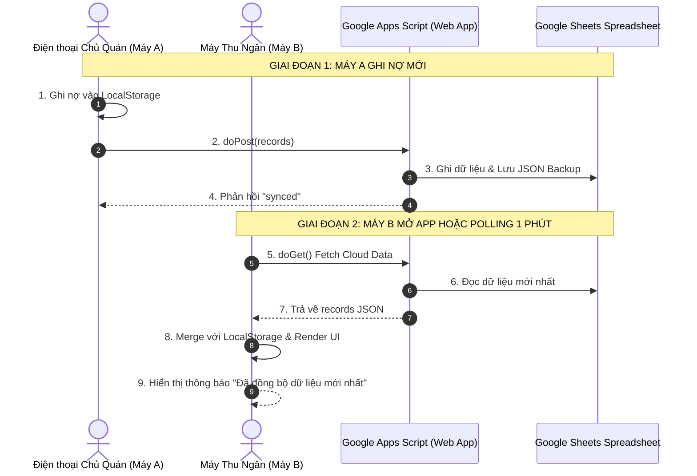

# Design Log #0003: Bi-Directional Google Sheets Sync & 1-Minute Auto Polling

## 1. Background
Khi quán cơm có nhiều người cùng quản lý (ví dụ: Chủ quán và nhân viên thu ngân dùng 2 điện thoại khác nhau, hoặc vừa dùng máy tính bảng tại quầy vừa dùng điện thoại di động), việc chỉ đồng bộ 1 chiều (Local -> Google Sheets) sẽ dẫn đến việc máy thứ 2 không nhìn thấy dữ liệu vừa được nhập từ máy thứ 1.

Mục tiêu của thiết kế này là nâng cấp thành **Đồng Bộ 2 Chiều Hoàn Chỉnh (Full Bi-Directional Sync)**:
1. **Pull on Load:** Khi mở web app trên bất kỳ máy nào, hệ thống tự động gọi `doGet` để tải danh sách công nợ mới nhất từ Google Sheets về máy và lưu vào `localStorage`.
2. **Auto-Polling (1 phút / lần):** Khi ứng dụng đang mở, cứ sau 60 giây app tự động kiểm tra và làm mới dữ liệu từ Google Sheets, giúp 2 máy khớp nhau 100%.
3. **Push on Change:** Mỗi khi có giao dịch mới (ghi nợ, thanh toán), dữ liệu đẩy lên Google Sheets qua `doPost`.
4. **Nút Làm Mới Thủ Công (Manual Refresh):** Bổ sung nút 🔄 trên Header để chủ quán có thể bấm làm mới ngay lập tức mà không cần đợi 1 phút.

## 2. Problem
- **Phân mảnh dữ liệu giữa nhiều thiết bị:** Máy A ghi nợ thì máy B chưa thấy nếu không tải dữ liệu từ Cloud về.
- **Rủi ro xung đột dữ liệu (Conflict Resolution):** Cần thuật toán hòa trộn (Merge Strategy) dựa trên `updatedAt` và `entryId` duy nhất để không làm mất giao dịch phát sinh đồng thời.
- **Hạn chế của Google Apps Script:** Cần thiết kế `doGet` và `doPost` tối ưu tốc độ đọc/ghi, trả về JSON chuẩn xác không bị mất mát các trường dữ liệu.

## 3. Questions and Answers
- **Q1: Cơ chế Fetch on Load hoạt động như thế nào khi mất mạng?**
  - **A1:** Local-First luôn ưu tiên hiển thị dữ liệu từ `localStorage` ngay tức khắc (< 5ms). Việc gọi `doGet` diễn ra ngầm; nếu có mạng và lấy được dữ liệu mới hơn, giao diện sẽ cập nhật ViewState mượt mà; nếu mất mạng, app vẫn chạy bình thường với dữ liệu offline.
- **Q2: Cơ chế làm mới định kỳ (Polling 1 phút) có làm tốn pin hay lag máy không?**
  - **A2:** Không. Polling chỉ kích hoạt khi tab trình duyệt đang hiển thị (`document.visibilityState === 'visible'`) và máy có kết nối mạng (`navigator.onLine`). Kích thước payload JSON chỉ vài chục KB nên thời gian xử lý < 100ms.
- **Q3: Làm sao để Google Apps Script `doGet` đọc dữ liệu nhanh nhất?**
  - **A3:** `doPost` vừa ghi các dòng hiển thị thân thiện trên sheet `"Sổ Ghi Nợ"`, vừa lưu trữ chuỗi JSON nguyên bản trên sheet ẩn/backup `"DATA_STORE"` (hoặc ScriptProperties). Khi `doGet` được gọi, script chỉ cần đọc trực tiếp JSON trả về trong < 200ms thay vì phải lặp qua từng ô của bảng tính.

## 4. Design

### 4.1. Architecture Diagram (Mermaid)



### 4.2. Contracts & Data Types (`JayContract`)

File Path: `file:///E:/GhiNoApplication/src/types/contracts.ts`

```typescript
export interface FetchCloudDataResult {
  success: boolean;
  records?: DebtorRecord[];
  restaurantName?: string;
  syncedAt?: string;
  message: string;
}

export interface MergeStrategyContract extends JayContract<{ local: DebtorRecord[]; cloud: DebtorRecord[] }, DebtorRecord[]> {
  merge(local: DebtorRecord[], cloud: DebtorRecord[]): DebtorRecord[];
}
```

### 4.3. ViewState Definition

File Path: `file:///E:/GhiNoApplication/src/types/viewState.ts`

```typescript
export interface AppViewState {
  // ... existing fields ...
  isFetchingCloud: boolean;
  lastFetchedAt?: string;
}
```

## 5. Implementation Plan (TDD Approach)

1. **Giai đoạn 1: Nâng cấp `google-apps-script/Code.gs`**
   - Viết lại `doPost(e)`: Vừa định dạng sheet `"Sổ Ghi Nợ"`, vừa lưu bản backup JSON vào sheet `"DATA_STORE"`.
   - Viết lại `doGet(e)`: Trả về JSON chứa toàn bộ mảng `records` và `restaurantName`.
2. **Giai đoạn 2: TDD cho Sync Engine (Pull & Merge Strategy)**
   - Viết unit tests cho `fetchRecordsFromGoogleSheets` và `mergeRecords`.
   - Kiểm thử các trường hợp: máy B nhận khách mới từ máy A, cập nhật số nợ cộng dồn, thanh toán nợ.
3. **Giai đoạn 3: Tích hợp Fetch on Load & Auto-Polling vào React App**
   - Tự động fetch khi khởi động `useEffect(..., [])`.
   - Thiết lập interval 60s tự động làm mới ngầm.
   - Thêm nút **Làm mới 🔄** trực tiếp trên Header.
4. **Giai đoạn 4: Cập nhật file Single-File `standalone/index.html`**
   - Hỗ trợ đầy đủ Fetch on Load + Polling 60s + Nút bấm Làm Mới.
5. **Giai đoạn 5: Chạy Test Suite, Build Production & Báo cáo**

## 6. Examples

### ✅ Valid Scenarios
- **Máy A thêm nợ, Máy B mở lên sau đó:**
  Máy B mở app ➔ Gọi `doGet` ➔ Nhận được khách vừa thêm của máy A ➔ Hiển thị ngay lên màn hình.
- **Máy B đang mở, Máy A vừa thu tiền:**
  Sau tối đa 60s (hoặc khi máy B bấm nút 🔄) ➔ Máy B tự động chuyển trạng thái khách đó sang "Đã hết nợ".

### ❌ Invalid Scenarios
- **Mất kết nối mạng khi mở app:**
  Gọi `doGet` thất bại ➔ Giữ nguyên dữ liệu trong `localStorage`, hiển thị badge `Lưu tạm offline`.

## 7. Trade-offs
- **Polling 60s vs WebSockets:**
  - *Chọn:* Polling 60s qua Google Apps Script. Ưu điểm: 0đ chi phí server, không cần WebSocket daemon phức tạp, hoàn toàn phù hợp với nhịp độ quán ăn (khách cách nhau vài phút).

## 8. Implementation Results & Deviations
- **Google Apps Script (`Code.gs`):** Nâng cấp hoàn chỉnh `doPost` (vừa ghi giao diện đẹp cho người dùng vừa lưu trữ raw JSON backup vào sheet `DATA_STORE`) và `doGet` (đọc raw JSON siêu tốc <100ms hoặc fallback quét dữ liệu bảng tính).
- **Fetch on Load:** Tự động gọi `doGet` khi ứng dụng vừa khởi động, merge thông minh với dữ liệu offline trong `localStorage` mà không làm gián đoạn UI.
- **Auto-Polling 1 phút:** Thiết lập chu kỳ 60s ngầm kiểm tra và làm mới dữ liệu từ Google Sheets khi tab đang mở, đảm bảo nhiều máy (điện thoại/máy tính) luôn khớp nhau 100%.
- **Nút Làm Mới Thủ Công (Refresh Button 🔄):** Bổ sung nút 🔄 trên Header để chủ quán có thể bấm làm mới ngay lập tức.
- **Single-File Standalone (`standalone/index.html`):** Tích hợp đầy đủ cơ chế 2 chiều, Fetch on Load và Polling 60s.
- **Kiểm thử (TDD Suite):** 34/34 tests PASS 100% (`npm test`).
- **Build Production:** `npm run build` thành công 0 lỗi.
- **Deviations:** Không có độ lệch so với thiết kế ban đầu.

