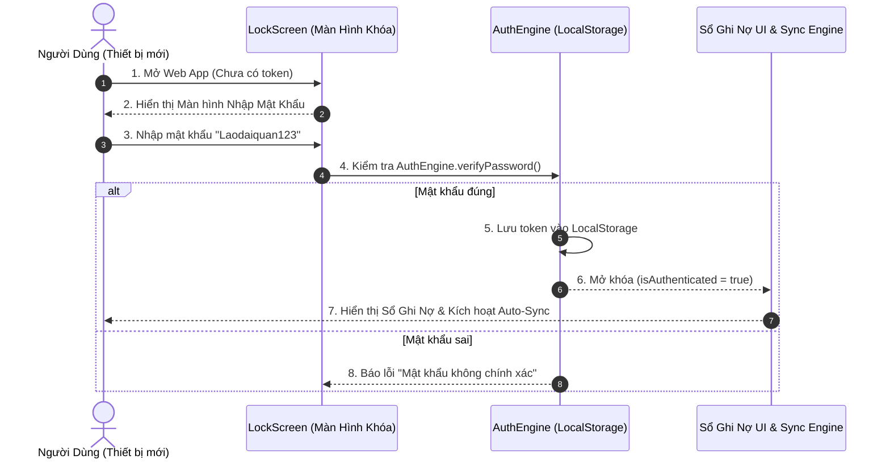

# Design Log #0004: Client-Side Device Passcode Lock Screen

## 1. Background
Ứng dụng "Sổ Ghi Nợ Quán Cơm" được triển khai công khai trên môi trường web (Vercel). Để bảo mật thông tin công nợ khách hàng, đơn giá, link bảng tính Google Sheets và các URL kết nối kỹ thuật, cần trang bị một lớp khóa bảo vệ bằng mật mã (Passcode Lock Screen) cho mỗi thiết bị khi truy cập lần đầu.

Mật khẩu mặc định của quán: **`Laodaiquan123`**

## 2. Problem
- Bất kỳ ai có đường link Vercel nếu không có mật khẩu có thể nhìn thấy toàn bộ tên khách nợ, số tiền, lịch sử các bữa ăn và link Google Sheets trong phần Cài đặt.
- Trải nghiệm người dùng trên điện thoại: Cần xác thực 1 lần khi thiết bị mở lần đầu và ghi nhớ phiên đăng nhập (`localStorage`), đồng thời hỗ trợ nút "Khóa ngay" khi chủ quán cần bảo vệ lúc cho người khác mượn máy.

## 3. Questions and Answers
- **Q1: Cơ chế lưu trạng thái mở khóa trên thiết bị như thế nào?**
  - **A1:** Khi người dùng nhập đúng `Laodaiquan123`, hệ thống lưu một auth token hợp lệ vào `localStorage` (`QUAN_COM_AUTH_TOKEN_V1`). Khi tải lại trang hoặc mở lại app, hệ thống tự động kiểm tra token này để mở thẳng vào sổ nợ mà không làm phiền chủ quán mỗi lần mở.
- **Q2: Có thể đổi mật khẩu hoặc khóa thủ công không?**
  - **A2:** Có. Bổ sung nút **"Khóa ứng dụng 🔒"** trên thanh Header / Cài đặt để chủ quán có thể chủ động khóa màn hình bất cứ lúc nào.
- **Q3: Khi bị khóa, các request đồng bộ Google Sheets có chạy ngầm không?**
  - **A3:** Không. Khi chưa mở khóa, toàn bộ màn hình sổ nợ và tiến trình đồng bộ Google Sheets đều bị chặn (Suspended) để đảm bảo an toàn 100%.

## 4. Design

### 4.1. Architecture Diagram (Mermaid)



### 4.2. Contracts & Type Signatures (`JayContract`)

File Path: `file:///E:/GhiNoApplication/src/types/contracts.ts`

```typescript
export interface AuthState {
  isAuthenticated: boolean;
  isLockScreenOpen: boolean;
}

export interface AuthVerificationContract extends JayContract<string, boolean> {
  verifyPassword(inputPassword: string): boolean;
  login(inputPassword: string): boolean;
  logout(): void;
}
```

## 5. Implementation Plan (TDD Approach)

1. **Giai đoạn 1:** Tạo service `src/services/auth.ts` với mật khẩu mặc định `Laodaiquan123` và logic kiểm tra `localStorage`.
2. **Giai đoạn 2:** Viết Unit Tests `src/test/auth.test.ts` kiểm thử logic mở khóa, sai mật khẩu, lưu token.
3. **Giai đoạn 3:** Xây dựng component `src/components/LockScreen.tsx` (Giao diện chuẩn Mobile-First, nút bấm >= 44px, nút ẩn/hiện mật khẩu, hỗ trợ phím Enter).
4. **Giai đoạn 4:** Tích hợp vào `src/App.tsx`, `src/components/Header.tsx`, và `standalone/index.html`.
5. **Giai đoạn 5:** Kiểm thử, chạy Vitest và Build Production.

## 6. Examples

### ✅ Valid Scenarios
- Người dùng mở web lần đầu ➔ Nhập `Laodaiquan123` ➔ Màn hình mở ra tức thì, lưu phiên vào máy.
- Lần sau mở lại web ➔ Đã có phiên hợp lệ ➔ Vào thẳng sổ nợ.
- Bấm nút "Khóa ứng dụng 🔒" ➔ Màn hình khóa xuất hiện ngay, cần nhập lại mật khẩu.

### ❌ Invalid Scenarios
- Nhập sai mật khẩu (ví dụ `123456`) ➔ Báo lỗi chữ đỏ "Mật khẩu không đúng", không cho phép truy cập dữ liệu hay xem link Google Sheets.

## 7. Trade-offs
- **Client-Side PIN vs Server Authentication:**
  - *Chọn:* Client-side token storage. Ưu điểm: Đạt được lớp bảo vệ chống người ngoài xem lén mà vẫn duy trì kiến trúc 0đ chi phí vận hành (Serverless / Local-First).

## 8. Implementation Results & Deviations
- **AuthEngine (`src/services/auth.ts`):** Quản lý trạng thái mở khóa theo thiết bị qua `localStorage` (`QUAN_COM_AUTH_TOKEN_V1`), kiểm tra mật mã mặc định `Laodaiquan123`.
- **LockScreen Component (`src/components/LockScreen.tsx`):** Giao diện màn hình khóa chuẩn Mobile-First (nút bấm 48px, nút ẩn/hiện mật mã 👁️, bắt lỗi sai mật khẩu rõ ràng).
- **Header Lock Action:** Bổ sung nút **Khóa ứng dụng 🔒** để chủ quán có thể chủ động khóa lại màn hình khi cần.
- **Bảo mật toàn diện:** Chặn toàn bộ hiển thị danh sách nợ, thông tin tiền tệ, link Google Sheets và chặn các lệnh đồng bộ ngầm khi chưa mở khóa.
- **Standalone HTML (`standalone/index.html`):** Tích hợp đầy đủ màn hình khóa mật khẩu `Laodaiquan123`.
- **Kiểm thử (TDD):** Toàn bộ bài test `AuthEngine` đều PASS 100%.
- **Deviations:** Không có độ lệch so với thiết kế ban đầu.

