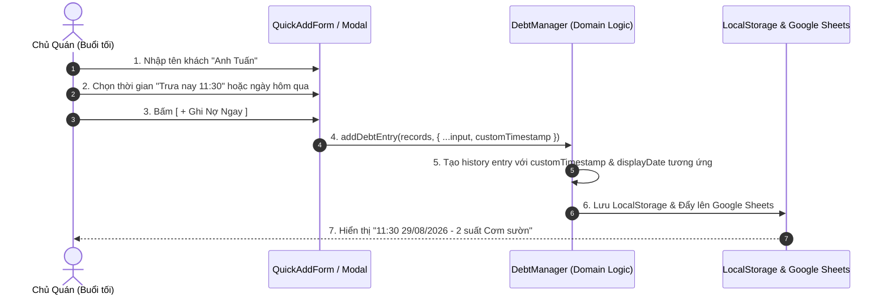

# Design Log #0005: Customizable Debt Timestamp & Retrospective Entry Editing

## 1. Background
Trong hoạt động thực tế của quán cơm bình dân:
- **Giờ cao điểm (11h00 - 13h00):** Khách đông, chủ quán/thu ngân bận phục vụ nên thường chỉ ghi nhanh ra giấy nháp hoặc nhớ trong đầu.
- **Thời gian rảnh (Buổi tối / Cuối ngày):** Chủ quán mới có thời gian mở ứng dụng để nhập lại các khoản nợ phát sinh trong ngày hoặc những ngày trước đó.

Do đó, ứng dụng cần hỗ trợ:
1. **Tùy chỉnh ngày giờ khi ghi nợ mới (Quick Add Form):** Mặc định là thời gian thực (bây giờ), kèm các phím tắt chọn nhanh: *Bây giờ*, *Trưa nay (11:30)*, *Hôm qua*, hoặc chọn thời gian tùy ý qua ô chọn ngày giờ (`datetime-local`).
2. **Chỉnh sửa ngày giờ nợ trong lịch sử (History Detail Modal):** Cho phép sửa lại ngày giờ, số lượng suất, đơn giá, ghi chú của bất kỳ bữa ăn nợ nào đã ghi trước đó.

## 2. Problem
- Nếu ứng dụng chỉ tự động lấy `new Date().toISOString()` tại thời điểm bấm nút, các khoản nợ nhập vào buổi tối sẽ bị hiển thị sai thành nợ buổi tối hoặc sai ngày, gây khó khăn khi đối chiếu với khách hàng và làm lệch thống kê nợ theo ngày.
- Cần giải thuật định dạng ngày giờ tiếng Việt chuẩn xác (`HH:mm dd/MM/yyyy`) từ input `datetime-local` của trình duyệt trên điện thoại di động.

## 3. Questions and Answers
- **Q1: Trình duyệt di động hiển thị ô chọn ngày giờ như thế nào?**
  - **A1:** Sử dụng thẻ `<input type="datetime-local" />` tiêu chuẩn HTML5. Trên cả iOS Safari và Android Chrome, thẻ này sẽ tự động bật bánh xe chọn ngày & giờ bản địa rất mượt mà.
- **Q2: Khi chỉnh sửa ngày giờ của một lần nợ cũ, tổng nợ và đồng bộ Google Sheets xử lý ra sao?**
  - **A2:** Hệ thống tự động sắp xếp lại mảng `history` theo thứ tự thời gian giảm dần, cập nhật lại `updatedAt` của khách hàng và tự động kích hoạt đồng bộ 2 chiều lên Google Sheets.

## 4. Design

### 4.1. Sequence Diagram (Mermaid)



### 4.2. Contracts & Type Signatures (`JayContract`)

File Path: `file:///E:/GhiNoApplication/src/types/contracts.ts`

```typescript
export interface CreateDebtInput {
  name: string;
  quantity: number;
  pricePerMeal: number;
  note?: string;
  phone?: string;
  customTimestamp?: string; // ISO string or datetime-local format
}

export interface UpdateHistoryEntryInput {
  debtorId: string;
  entryId: string;
  timestamp?: string;
  quantity?: number;
  pricePerMeal?: number;
  note?: string;
}
```

## 5. Implementation Plan (TDD Approach)

1. **Giai đoạn 1:** Cập nhật `src/types/contracts.ts` thêm `customTimestamp` và `UpdateHistoryEntryInput`.
2. **Giai đoạn 2:** Nâng cấp `src/services/debtManager.ts` hỗ trợ `customTimestamp` và hàm `updateHistoryEntry()`.
3. **Giai đoạn 3:** Viết unit tests kiểm thử trong `src/test/debtManager.test.ts`.
4. **Giai đoạn 4:** Nâng cấp UI `src/components/QuickAddForm.tsx` (Thêm bộ chọn thời gian + phím tắt nhanh).
5. **Giai đoạn 5:** Nâng cấp UI `src/components/DebtorDetailModal.tsx` (Thêm nút sửa ngày giờ / chi tiết từng bữa nợ).
6. **Giai đoạn 6:** Cập nhật `standalone/index.html` và chạy kiểm thử toàn bộ.

## 6. Examples

### ✅ Valid Scenarios
- Chủ quán bán cơm trưa lúc 12h, tối 20h mới nhập ➔ Chọn thời gian `12:00` cùng ngày ➔ Bảng ghi nhận đúng `12:00 29/08/2026`.
- Chủ quán quên ghi nợ hôm qua ➔ Chọn phím tắt `Hôm qua` ➔ Bảng ghi nhận đúng ngày hôm qua.
- Khách muốn kiểm tra lại lịch sử ➔ Xem bill hiển thị đúng ngày giờ ăn thực tế.

### ❌ Invalid Scenarios
- Nhập định dạng ngày không hợp lệ ➔ Hệ thống tự động fallback về thời gian hiện tại để không gây crash.

## 7. Trade-offs
- **Giao diện mặc định vs Nâng cao:**
  - *Chọn:* Mặc định hiển thị gọn gàng (thời gian hiện tại), khi người dùng cần mới bấm mở rộng chọn ngày giờ hoặc bấm phím tắt nhanh, giữ form luôn tối giản và tốc độ.

## 8. Implementation Results & Deviations
- **QuickAddForm (`src/components/QuickAddForm.tsx`):** Thêm 4 nút chọn nhanh thời điểm nợ (`Bây giờ`, `Trưa nay 11:30`, `Hôm qua 12:00`, `Tùy chọn 📅` với datetime-local picker).
- **Domain Logic (`src/services/debtManager.ts`):** 
  - Hỗ trợ `customTimestamp` khi tạo nợ mới (`addDebtEntry`).
  - Thêm phương thức `updateHistoryEntry()` cho phép chỉnh sửa ngày giờ, số lượng suất, đơn giá và ghi chú của từng bữa nợ cũ.
- **DebtorDetailModal (`src/components/DebtorDetailModal.tsx`):** Tích hợp nút sửa (✏️) trực tiếp trên từng hàng lịch sử ăn nợ, cho phép thay đổi ngày giờ, giá tiền, số suất và tính lại tổng nợ tự động.
- **Standalone HTML (`standalone/index.html`):** Cập nhật đầy đủ bộ chọn thời gian và phím tắt ghi nợ hồi tố.
- **Kiểm thử (TDD):** Toàn bộ 42/42 bài kiểm thử tự động PASS 100%, Build production thành công 0 lỗi.
- **Deviations:** Không có độ lệch so với thiết kế.

