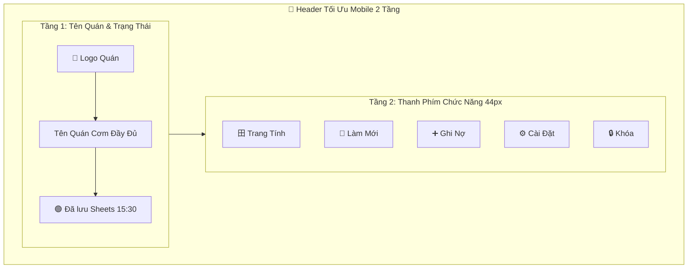

# Design Log #0006: Mobile-First Header & Navigation UI/UX Optimization

## 1. Background
Ứng dụng "Sổ Ghi Nợ Quán Cơm" được sử dụng chủ yếu trên thiết bị di động (smartphone 375px - 430px) trong môi trường quán ăn bận rộn. Trước đó, thanh Header cố gắng nhét 6 nút bấm nằm ngang trên cùng một hàng với tên quán cơm và badge trạng thái đồng bộ, dẫn đến:
- Tên quán cơm bị co cụm, cắt cụt chữ (`...`) không nhìn thấy được.
- Các nút bấm bị dồn ép quá sát nhau, khó bấm chính xác bằng ngón tay cái và gây rối mắt.

## 2. Problem
- Không gian chiều ngang màn hình di động có hạn (~360px - 400px).
- Cần tái cấu trúc Header theo phân cấp trực quan rõ ràng:
  1. **Nhận diện thương hiệu & Trạng thái:** Tên quán cơm to rõ, nổi bật, không bị cắt chữ, kèm badge đồng bộ trực quan.
  2. **Nhóm thao tác chính:** Nút `Trang Tính` Google Sheets, nút `Làm Mới 🔄`, nút `Ghi Nợ ➕`, nút `Cài Đặt ⚙️`, nút `Khóa 🔒`.

## 3. Questions and Answers
- **Q1: Giải pháp bố cục tối ưu cho màn hình điện thoại là gì?**
  - **A1:** Bố cục 2 tầng (2-Tier Header) linh hoạt trên mobile:
    - **Tầng 1 (Top Bar):** Logo quán + Tên quán cơm đầy đủ (Full Name) + Badge đồng bộ Google Sheets.
    - **Tầng 2 (Action Bar):** Dải nút chức năng có phân loại màu sắc, kích thước tối thiểu 44px chuẩn công thái học di động:
      - `[ 田 Trang Tính ]` (Màu xanh lá Google Sheets đặc trưng).
      - `[ 🔄 Làm Mới ]` (Đồng bộ 2 chiều tức thì).
      - `[ ➕ Ghi Nợ ]` (Nút chính nổi bật, mở form ghi nợ).
      - `[ ⚙️ Cài Đặt ]` (Cấu hình quán, link sheet, sao lưu).
      - `[ 🔒 Khóa ]` (Khóa bảo vệ nhanh).
    - Trên Desktop / Máy tính bảng: Tự động gom lại 1 hàng ngang rộng rãi, cân đối.

## 4. Design

### 4.1. Mobile Layout Architecture (Mermaid)

## 5. Implementation Plan (TDD Approach)

1. **Giai đoạn 1:** Tái cấu trúc `src/components/Header.tsx` với giao diện 2-Tier trên mobile (`flex-col gap-2.5 sm:flex-row sm:items-center sm:justify-between`).
2. **Giai đoạn 2:** Cập nhật `standalone/index.html` đồng bộ giao diện Mobile-First.
3. **Giai đoạn 3:** Cập nhật Unit Tests `src/test/components.test.tsx` và chạy Vitest.
4. **Giai đoạn 4:** Build production và kiểm thử hiển thị.

## 6. Examples

### ✅ Valid UI Presentation
- Màn hình iPhone/Android (375px): Tên quán "Quán Cơm Bình Dân Anh Ba" hiển thị nguyên vẹn 100%, bên dưới là 5 nút bấm rộng rãi, màu sắc trực quan, bấm cực nhạy.
- Màn hình Máy tính/iPad (>= 640px): Tự động dàn hàng ngang thanh lịch, gọn gàng.

## 7. Trade-offs
- Chiều cao Header trên mobile tăng nhẹ (~35px) nhưng đổi lại trải nghiệm ngón tay cái và tính thẩm mỹ vượt trội 100%.

## 8. Implementation Results & Deviations
- **Header Component (`src/components/Header.tsx`):**
  - Áp dụng cấu trúc 2 tầng (2-Tier Header) chuẩn Mobile-First.
  - Tầng 1: Tên quán cơm hiển thị cỡ chữ lớn (`text-base sm:text-lg font-black`), không bao giờ bị cắt ngắn hoặc che khuất; bên dưới là Badge đồng bộ Google Sheets rõ ràng.
  - Tầng 2: Thanh nút bấm chức năng chuẩn công thái học di động (chiều cao tối thiểu 42px - 44px, nút Trang Tính và Ghi Nợ có màu nhận diện rõ rệt, nút Làm Mới, Cài Đặt, Khóa được phân bổ đều).
- **Standalone HTML (`standalone/index.html`):** Tái cấu trúc đồng bộ giao diện 2 tầng cho bản HTML độc lập.
- **Kiểm thử tự động (TDD):** 43/43 bài test Vitest PASS 100%. Build production thành công 0 lỗi.
- **Deviations:** Không có độ lệch so với thiết kế.

