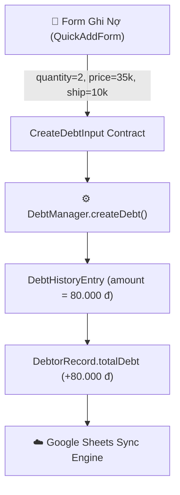

# Design Log #0007: Shipping Fee (Phí Giao Hàng) Integration

## 1. Background
Quán cơm thường xuyên có khách đặt cơm giao tận nơi (cơm văn phòng, công trình, nhà riêng) và cộng thêm tiền công nợ bao gồm cả tiền cơm và tiền phí ship (5.000đ, 10.000đ, 15.000đ...). Hiện tại hệ thống chỉ tính `Thành tiền = Số suất * Đơn giá`, chưa có trường phí ship riêng biệt.

## 2. Problem
- Khi khách nợ cả tiền cơm lẫn tiền ship, người bán phải tự cộng gộp vào đơn giá hoặc ghi chú thủ công, gây khó khăn cho việc tra cứu chi tiết từng bữa ăn.
- Cần bổ sung trường `shippingFee` tùy chọn (optional) đảm bảo tương thích ngược 100% với các dữ liệu nợ đã tạo trước đó.

## 3. Questions and Answers
- **Q1: Công thức tính thành tiền của mỗi bữa ăn khi có phí ship là gì?**
  - **A1:** $\text{amount} = (\text{quantity} \times \text{pricePerMeal}) + (\text{shippingFee} \parallel 0)$.
- **Q2: Dữ liệu cũ có bị ảnh hưởng không?**
  - **A2:** Không. Mọi bản ghi cũ nếu không có `shippingFee` sẽ tự động mặc định là `0`, tổng nợ giữ nguyên tuyệt đối.
- **Q3: Trải nghiệm nhập trên điện thoại như thế nào để thao tác nhanh nhất?**
  - **A3:** Cung cấp các nút bấm nhanh (Quick Chips): `[ 0 đ ]`, `[ 5k ]`, `[ 10k ]`, `[ 15k ]`, `[ ✏️ Tùy chọn ]`.

## 4. Design

### 4.1. Entity & Data Contract Flow (Mermaid)



### 4.2. Contract Specifications

- **`DebtHistoryEntry`**:
  ```typescript
  export interface DebtHistoryEntry {
    entryId: string;
    timestamp: string;
    displayDate: string;
    quantity: number;
    pricePerMeal: number;
    shippingFee?: number; // Mới: Phí giao hàng (VNĐ)
    amount: number;       // = quantity * pricePerMeal + (shippingFee || 0)
    note?: string;
  }
  ```

- **`CreateDebtInput`**:
  ```typescript
  export interface CreateDebtInput {
    name: string;
    phone?: string;
    quantity: number;
    pricePerMeal: number;
    shippingFee?: number; // Mới: Phí ship tùy chọn
    customTimestamp?: string;
    note?: string;
  }
  ```

- **`UpdateHistoryEntryInput`**:
  ```typescript
  export interface UpdateHistoryEntryInput {
    debtorId: string;
    entryId: string;
    timestamp?: string;
    quantity?: number;
    pricePerMeal?: number;
    shippingFee?: number; // Mới: Sửa phí ship
    note?: string;
  }
  ```

## 5. Implementation Plan (TDD Approach)

1. **Giai đoạn 1 (Contracts):** Cập nhật `src/types/contracts.ts` và `src/contracts/debtContract.ts`.
2. **Giai đoạn 2 (Logic & TDD):** Cập nhật `src/services/debtManager.ts` và viết unit test trong `src/test/debtManager.test.ts` & `src/test/debtContract.test.ts`.
3. **Giai đoạn 3 (UI):**
   - Tích hợp Quick Chips & Input phí ship trong `src/components/QuickAddForm.tsx`.
   - Hiển thị và hỗ trợ sửa phí ship trong `src/components/DebtorDetailModal.tsx`.
   - Cập nhật bản Standalone HTML `standalone/index.html`.
4. **Giai đoạn 4 (Google Sheets & Verification):**
   - Cập nhật `google-apps-script/Code.gs`.
   - Chạy test Vitest và build production.

## 6. Examples

### ✅ Valid Examples
- Ăn tại quán: 1 suất 35k, ship 0đ -> Thành tiền 35.000 đ.
- Ship văn phòng: 2 suất 35k (70k), ship 10k -> Thành tiền 80.000 đ.

## 7. Trade-offs
- Thêm 1 trường dữ liệu nhưng giúp minh bạch 100% dòng tiền giữa tiền cơm và tiền ship.

## 8. Implementation Results & Deviations
- **Contracts (`src/types/contracts.ts`, `src/contracts/debtContract.ts`):**
  - Bổ sung trường `shippingFee?: number` (không âm, tùy chọn) vào `DebtHistoryEntry`, `CreateDebtInput`, `UpdateHistoryEntryInput`, `BackupPayloadContract`.
- **Logic Tính Toán (`src/services/debtManager.ts`):**
  - Công thức tính thành tiền: $\text{amount} = (\text{quantity} \times \text{pricePerMeal}) + (\text{shippingFee} \parallel 0)$.
  - Tự động cộng dồn vào `totalDebt` và hỗ trợ sửa lại phí ship khi cập nhật bữa ăn.
- **Giao Diện Nhập Nhanh (`src/components/QuickAddForm.tsx` & `standalone/index.html`):**
  - Thêm dải phím chọn nhanh phí ship: `[ 0 đ ]`, `[ +5k ]`, `[ +10k ]`, `[ +15k ]`, `[ ✏️ Khác... ]`.
  - Preview thời gian thực: Hiển thị chi tiết tiền cơm + tiền ship = tổng tiền.
- **Chi Tiết Bữa Ăn & Sao Chép Hóa Đơn (`src/components/DebtorDetailModal.tsx`):**
  - Hiển thị huy hiệu `+ Ship: 10.000 đ` cho các đơn giao tận nơi.
  - Cho phép chỉnh sửa phí ship trực tiếp bằng nút bút chì ✏️.
  - Sao chép hóa đơn Zalo tự động liệt kê tiền ship minh bạch.
- **Google Apps Script (`google-apps-script/Code.gs`):**
  - Đính kèm thông tin phí ship vào cột ghi chú trên Google Sheets.
- **Kiểm Thử & Build:** 46/46 bài test Vitest PASS 100%. Build production thành công 0 lỗi.
- **Deviations:** Không có độ lệch so với thiết kế.

