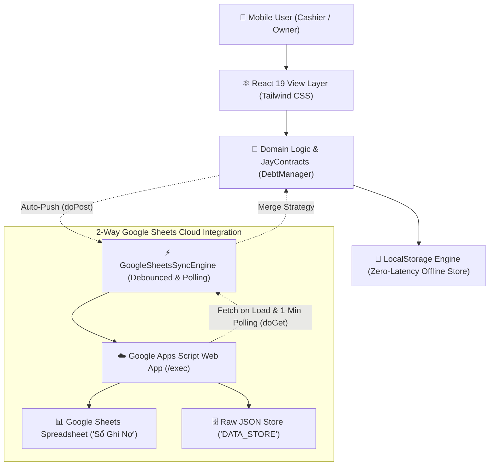

# 02. System Architecture & Technical Specifications

## 1. High-Level Architecture Diagram

---

## 2. Core Architectural Principles

1. **Local-First & Optimistic UI:**
   - Every user mutation (add debt, settle balance, delete entry) writes to in-memory state and `localStorage` instantly (<10ms).
   - The UI updates immediately without waiting for network I/O.

2. **Non-Blocking Background Cloud Synchronization:**
   - Client-side network requests to Google Apps Script use `mode: 'no-cors'` with a debounced delay of `1200ms`.
   - Network timeouts or connection losses never freeze or degrade the user experience.

3. **Bi-Directional Multi-Device Reconciliation:**
   - **On Load:** The client executes `fetchRecordsFromGoogleSheets()` to retrieve the latest state.
   - **Auto-Polling:** Every 60 seconds (when the tab is visible and network is active), the client pulls new changes and applies an intelligent timestamp-based merge strategy (`mergeCloudAndLocalRecords`).

4. **Zero-Cost & Serverless:**
   - The frontend is hosted entirely as static assets on Edge CDNs (Vercel / GitHub Pages).
   - Google Apps Script provides a 100% free serverless API layer connected directly to Google Sheets.

---

## 3. Storage & Memory Management

- **Storage Key:** `QUAN_COM_DEBT_RECORDS_V1` (Records), `QUAN_COM_SETTINGS_V1` (Settings).
- **Capacity:** Browser `localStorage` offers ~5MB to 10MB of storage. A typical debtor record with 10 history entries consumes ~500 bytes, allowing storage for over **10,000 to 20,000 debtor profiles** (decades of operations for a local dining eatery).
- **Format:** Strongly-typed UTF-8 JSON strings with sanitized inputs and JayContract validation.
